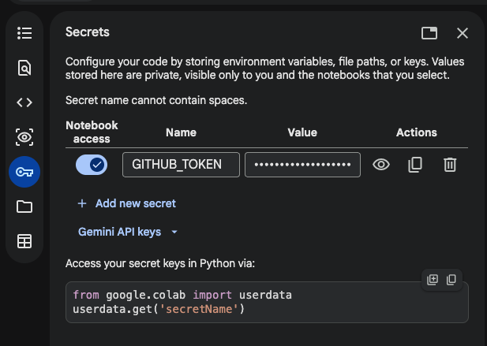

# AIPI 590.03 Intelligent Agents — Project 1: Spatial Reasoning Fine-Tuning

[](https://github.com/spatialft/spatialft.github.io/actions/workflows/deploy.yml)
[](https://spatialft.github.io/)
[](https://masters.pratt.duke.edu/)
[](https://huggingface.co/spatialft/LFM2-350M-StepGame-GGUF)

Fine-tune **LiquidAI/LFM2-350M** to improve spatial reasoning, measure baseline performance, then re-evaluate to show improvement.

## Property: Spatial Reasoning

Small models struggle to reliably track multi-hop directional relationships ("A is left of B, B is above C. Where is A relative to C?"). This project measures that capability, fine-tunes on StepGame spatial QA examples, and re-evaluates.

## Dataset

[StepGame](https://github.com/ZhengxiangShi/StepGame): multi-step spatial QA with k-hop difficulty levels (k=1..10).

## Model

`LiquidAI/LFM2-350M`: a 354M-parameter LFM2 checkpoint. It fits on a single T4 GPU with `transformers` + `peft`, which keeps iteration fast and stays close to an edge-deployment setting without treating deployment claims as the result.

The fine-tuned model is available as a merged GGUF at [spatialft/LFM2-350M-StepGame-GGUF](https://huggingface.co/spatialft/LFM2-350M-StepGame-GGUF).

## Project structure

```
data/                       committed for reproducibility (JSON splits only)
  raw/          downloaded StepGame splits
  processed/    formatted prompt/completion pairs
  eval/         held-out evaluation set
notebooks/
  01_baseline_eval.ipynb    measure baseline accuracy
  02_dataset_prep.ipynb     download StepGame, prepare fine-tuning data
  03_finetune.ipynb         LoRA fine-tuning with transformers+peft
  04_eval_comparison.ipynb  compare before vs after, export examples
src/
  dataset.py    StepGame loading + prompt formatting
  eval.py       accuracy evaluation logic (includes per-hop breakdown)
  colab_utils.py shared Colab bootstrap, shared-storage, and GitHub publish helpers
results/
  baseline/     baseline predictions + scores
  finetuned/    fine-tuned predictions (gitignored) + scores
  examples.json showcase examples for the landing page
scripts/
  generate_checklist.py   builds docs/checklist/index.html
  generate_index.py       builds docs/index.html (results + examples)
  auto_check.py           auto-marks completed checklist items (CI)
docs/
  index.html    landing page — gitignored, generated by CI
  checklist/    requirements checklist — gitignored, generated by CI
```

## Quickstart (Colab T4)

**Before opening any notebook:** set the runtime to T4 GPU (Runtime → Change runtime type → T4 GPU).

Each notebook has an **Open in Colab** badge at the top. Run in order:

1. `02_dataset_prep`: downloads StepGame, saves splits to `data/`
2. `01_baseline_eval`: measures baseline accuracy
3. `03_finetune`: LoRA fine-tunes the model, saves the adapter to `results/finetuned/lora_adapter/`, and publishes it to GitHub
4. `04_eval_comparison`: pulls latest `main`, loads the published adapter, evaluates the fine-tuned model, and exports examples

The notebooks share common setup via `src/colab_utils.py`. Notebooks 03 and 04 can push results to `main` from their final cell if a `GITHUB_TOKEN` secret is set.

**Setting up the GitHub token (one-time):**

```sh
make colab-pat   # opens the pre-filled GitHub fine-grained PAT form
```

Create the token (GitHub will still ask you to confirm repository access — select `spatialft.github.io`), then add it to Colab: open the key icon in the left sidebar → **Secrets** → **Add new secret**, name it `GITHUB_TOKEN`, paste the token, and enable notebook access.



After running 01 and 04, commit the generated scores and examples to update the [live results page](https://spatialft.github.io/).

For packaging the fine-tuned adapter as a GGUF model for `lm-arena`, see [docs/lm-arena-export.md](/Users/jonasneves/Github/organizations/spatialft.github.io/docs/lm-arena-export.md).

## Results

Measured on 250 held-out examples (50 per hop level, k=1..5):

| | Baseline | Fine-tuned |
|---|---|---|
| **Overall** | 16.0% | 70.4% |
| k=1 | 24% | 94% |
| k=2 | 14% | 84% |
| k=3 | 14% | 72% |
| k=4 | 18% | 50% |
| k=5 | 10% | 52% |

Per-hop breakdown and examples on the [live results page](https://spatialft.github.io/).

## Requirements Checklist

Tracked in [`REQUIREMENTS_CHECKLIST.md`](REQUIREMENTS_CHECKLIST.md).

## Team

Jonas Neves · Daniel Ros · Keming Zhou
